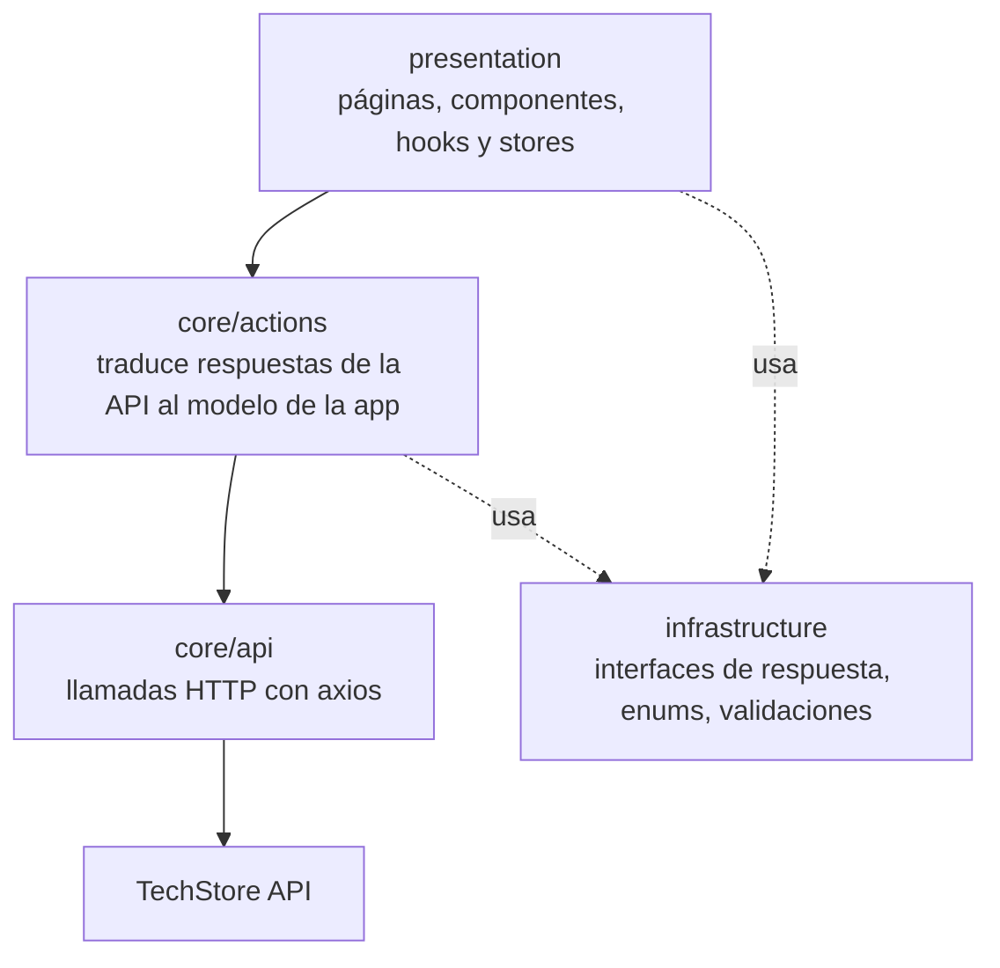
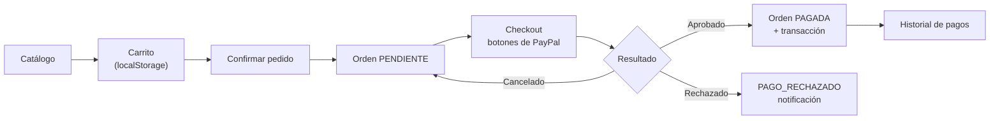

# TechStore Web

Interfaz web de una tienda en línea de productos tecnológicos: catálogo, carrito de compras, administración por rol y **pago con PayPal (Sandbox)**.

Este repositorio contiene el **frontend**. Consume la API REST del repositorio [techstore-api](https://github.com/JaredCoto0418/techstore-api), que debe estar corriendo para que la aplicación funcione.

> Proyecto académico — Universidad Nacional Autónoma de Honduras (UNAH), asignatura *Paradigmas de Programación*, Unidad 3.

---

## Tabla de contenido

1. [Contexto y alcance](#1-contexto-y-alcance)
2. [Arquitectura](#2-arquitectura)
3. [Stack tecnológico y justificación](#3-stack-tecnológico-y-justificación)
4. [Mapa de pantallas](#4-mapa-de-pantallas)
5. [Requerimientos funcionales](#5-requerimientos-funcionales)
6. [Requerimientos no funcionales](#6-requerimientos-no-funcionales)
7. [Flujos principales](#7-flujos-principales)
8. [Instalación y ejecución](#8-instalación-y-ejecución)
9. [Estructura del proyecto](#9-estructura-del-proyecto)
10. [Convenciones de código](#10-convenciones-de-código)
11. [Flujo de trabajo con Git](#11-flujo-de-trabajo-con-git)
12. [Equipo y aportes](#12-equipo-y-aportes)
13. [Estado actual y limitaciones](#13-estado-actual-y-limitaciones)

---

## 1. Contexto y alcance

La aplicación es una **SPA** que ofrece una interfaz distinta a cada tipo de usuario sobre la misma API:

| Usuario | Qué puede hacer |
|---|---|
| **Visitante** | Ver el catálogo público sin registrarse |
| **Cliente** | Armar un carrito, generar pedidos, pagarlos con PayPal y consultar su historial de pagos |
| **Vendedor** | Administrar sus productos y actualizar el estado de las órdenes que le corresponden |
| **Administrador** | Gestionar usuarios, roles, categorías, productos y todas las órdenes |

El objetivo central de esta unidad fue **cerrar el ciclo de compra dentro de la aplicación**: que el cliente pueda pagar sin salir del sistema y que ese pago quede registrado y sea consultable.

---

## 2. Arquitectura

El proyecto sigue una **arquitectura por capas**, con dependencias en una sola dirección: la interfaz nunca habla directamente con HTTP.



| Capa | Responsabilidad |
|---|---|
| `core/api` | Peticiones HTTP puras. Un único cliente axios inyecta el token JWT en cada llamada. |
| `core/actions` | Traduce la respuesta de la API al modelo que consume la interfaz y normaliza los errores. Ningún componente maneja códigos HTTP. |
| `core/models` · `infrastructure/interfaces` | Tipos de dominio y contratos de respuesta. El flujo de datos está tipado de extremo a extremo. |
| `presentation/hooks` | Estado y efectos de cada dominio (`useProducts`, `useOrders`, `useTransactions`). Las páginas consumen hooks, no acciones sueltas. |
| `presentation/stores` | Estado global con zustand: sesión (`authStore`) y carrito (`cartStore`). |
| `presentation/pages` · `components` | Interfaz, organizada por rol. Los componentes compartidos viven en `components/shared`. |
| `router` | Rutas y control de acceso por rol. |

### Manejo de la sesión

El JWT se guarda en `localStorage`. Al arrancar, `authStore` **decodifica el token, extrae los roles y verifica la fecha de expiración**: si el token venció, la sesión no se restaura. El componente `ProtectedRoute` bloquea las rutas según el rol contenido en el token, y la ruta raíz redirige a cada usuario a su panel correspondiente.

Esto es control de acceso **de interfaz**, no de seguridad: la autorización real la impone la API en cada endpoint. Ocultar un botón no protege nada por sí solo.

---

## 3. Stack tecnológico y justificación

| Componente | Elección | Por qué |
|---|---|---|
| Librería de UI | **React 19** | Modelo de componentes conocido por todo el equipo y con el mayor ecosistema disponible. |
| Lenguaje | **TypeScript** | El tipado detecta en compilación los desajustes con los contratos de la API. En un proyecto con dos repositorios que evolucionan en paralelo, esto evitó una clase entera de errores. |
| Empaquetador | **Vite 7** | Arranque casi inmediato y recarga en caliente muy rápida. La verificación de tipos se ejecuta en el build (`tsc -b`), no en cada guardado. |
| Estilos | **Tailwind CSS** | Estilos junto al marcado, sin archivos CSS paralelos ni conflictos de nombres. Su sistema de *breakpoints* resolvió el diseño responsivo sin escribir media queries a mano. |
| Estado global | **zustand** | Solo hacían falta dos porciones de estado global: sesión y carrito. Redux habría añadido mucha ceremonia; zustand resuelve lo mismo en pocas líneas y sin envolver la aplicación en proveedores. |
| Enrutado | **React Router 6** | Estándar de facto, con rutas anidadas y redirecciones declarativas. |
| Cliente HTTP | **axios** | Interceptores: el token se inyecta en un solo lugar en vez de repetir cabeceras en cada llamada. |
| Pagos | **@paypal/react-paypal-js** | SDK oficial de PayPal para React. Los botones se renderizan dentro del contexto de PayPal, de modo que las credenciales sensibles nunca pasan por nuestro código. |
| Notificaciones | **react-hot-toast** | Reemplazó los `alert()` nativos, que bloquean el hilo de la interfaz y rompen la experiencia. |
| Formularios | **Formik + Yup** | Validación declarativa en el formulario de acceso. |

---

## 4. Mapa de pantallas

| Ruta | Pantalla | Acceso |
|---|---|---|
| `/login` | Inicio de sesión | Público |
| `/catalog` | Catálogo (versión pública o de cliente según la sesión) | Público / Cliente |
| `/` | Panel principal; redirige según el rol | Autenticado |
| `/cart` | Carrito de compras | Cliente |
| `/checkout/:orderId` | Pago de una orden con PayPal | Cliente |
| `/client/orders` | Mis órdenes | Cliente |
| `/client/transactions` | Historial de pagos | Cliente |
| `/vendor/products` | Mis productos | Vendedor |
| `/vendor/orders` | Órdenes por atender | Vendedor |
| `/admin` | Panel de administración | Administrador |
| `/admin/users` | Gestión de usuarios | Administrador |
| `/admin/products` | Gestión de productos | Administrador, Vendedor |
| `/admin/categories` | Gestión de categorías | Administrador |
| `/admin/orders` | Todas las órdenes | Administrador |

Cualquier ruta desconocida redirige a la raíz, y esta a su vez al panel del rol o al inicio de sesión.

---

## 5. Requerimientos funcionales

| ID | Requerimiento | Criterio de aceptación |
|---|---|---|
| RF-01 | Inicio de sesión | El usuario accede con correo y contraseña; los errores se muestran en el formulario y la sesión persiste al recargar mientras el token siga vigente |
| RF-02 | Catálogo público | Un visitante sin sesión ve los productos disponibles con imagen, precio y existencias |
| RF-03 | Agregar al carrito | El cliente agrega productos desde el catálogo; el contador del menú refleja la cantidad total |
| RF-04 | Gestión del carrito | Puede cambiar cantidades, eliminar ítems y ver el total actualizado; el carrito sobrevive a recargas de la página |
| RF-05 | Confirmar pedido | Al confirmar se crea una orden con todos los ítems y el carrito queda vacío |
| RF-06 | Pagar con PayPal | Desde una orden pendiente el cliente accede al checkout y paga con los botones oficiales de PayPal |
| RF-07 | Resultado del pago | El éxito lleva al historial con la orden en estado *Pagada*; el rechazo o la cancelación se notifican sin perder la orden |
| RF-08 | Historial de pagos | El cliente consulta sus transacciones con identificador de la pasarela, monto, estado y fecha |
| RF-09 | Mis órdenes | El cliente ve sus órdenes con estado y detalle de productos |
| RF-10 | Gestión de productos | Vendedor y administrador crean, editan y eliminan productos, con carga y previsualización de imagen |
| RF-11 | Gestión de categorías y usuarios | El administrador gestiona categorías, usuarios y roles desde su panel |
| RF-12 | Estados de orden | El vendedor actualiza el estado de las órdenes que le corresponden |
| RF-13 | Retroalimentación | Toda acción produce una notificación de éxito o error, y las esperas muestran indicador de carga |

---

## 6. Requerimientos no funcionales

| ID | Requerimiento | Cómo se cumple |
|---|---|---|
| RNF-01 | **Seguridad en el cliente** | El token se envía por interceptor; las rutas se protegen por rol y la sesión expira con el token. Ninguna credencial sensible de PayPal reside en el frontend: solo el Client ID, que es público. |
| RNF-02 | **Diseño responsivo** | Las vistas usan cuadrículas fluidas de Tailwind y se verificaron en resoluciones de móvil, tableta y escritorio. |
| RNF-03 | **Consistencia visual** | Componentes compartidos (`StatusBadge`, `ProductCard`, `ProductFormModal`) garantizan que un mismo concepto se vea igual en todas las pantallas. |
| RNF-04 | **Mantenibilidad** | Capas con dependencia unidireccional, un único cliente HTTP y utilidades compartidas de formato, token e imágenes. Tras el pase de calidad, las dos pantallas más grandes bajaron de ~595 a ~230 y de ~593 a ~215 líneas. |
| RNF-05 | **Tipado estricto** | El build ejecuta `tsc -b`: el proyecto no compila si un contrato de la API deja de coincidir con su interfaz. |
| RNF-06 | **Experiencia de uso** | Notificaciones no bloqueantes, indicadores de carga en operaciones asíncronas y confirmación antes de acciones destructivas. |
| RNF-07 | **Trazabilidad** | GitFlow con ramas por funcionalidad y commits individuales por integrante. |

---

## 7. Flujos principales

### Del catálogo al pago



### Detalle del pago

1. El cliente entra a `/checkout/:orderId` desde el botón **Pagar** de una orden pendiente.
2. La pantalla carga la orden y muestra el resumen de ítems y el total. Si la orden ya está pagada, no se renderizan los botones de pago.
3. Al pulsar el botón de PayPal, `createOrder` llama a la API, que crea la orden en PayPal y devuelve su identificador.
4. El usuario aprueba el pago en la ventana de PayPal.
5. `onApprove` llama al endpoint de captura. La API confirma el cobro, registra la transacción y actualiza el estado de la orden.
6. Con el pago exitoso se notifica y se redirige al historial. Si es rechazado, se notifica y se vuelve a *Mis órdenes*, donde la orden queda visible con su estado real.

El carrito vive en `localStorage`, por lo que sobrevive a recargas. Se vacía al confirmar el pedido, no al pagar: si el pago falla, la orden ya existe y puede reintentarse desde *Mis órdenes* sin rearmar el carrito.

---

## 8. Instalación y ejecución

### Prerrequisitos

| Herramienta | Versión |
|---|---|
| Node.js | 18 o superior (recomendado 20 LTS) |
| npm | 9 o superior |
| [techstore-api](https://github.com/JaredCoto0418/techstore-api) | Corriendo en `https://localhost:7066` |

> **Levanta primero el backend.** Sin la API, la aplicación carga pero no muestra datos. Las instrucciones están en el README de ese repositorio.

### Paso 1 — Clonar e instalar

```bash
git clone https://github.com/JaredCoto0418/techstore-web.git
cd techstore-web
npm install
```

### Paso 2 — Configurar las variables de entorno

Crea un archivo `.env.local` en la raíz. **No se sube al repositorio**:

```env
VITE_PAYPAL_CLIENT_ID=tu_client_id_de_sandbox
```

`VITE_PAYPAL_CLIENT_ID` es el **mismo Client ID** que configuraste en el backend. Es un valor público, pensado para usarse en el navegador; el *Secret*, en cambio, jamás debe aparecer aquí.

Si no defines esta variable, la aplicación funciona con normalidad, pero la pantalla de checkout avisa que falta configurar el Client ID en lugar de mostrar los botones de pago.

> **Puerto de la API.** Por defecto la aplicación apunta a `https://localhost:7066/api`, que es donde arranca el backend. Solo necesitas tocar `VITE_API_URL` si cambias ese puerto — y en ese caso conviene leer antes la nota en [Limitaciones](#13-estado-actual-y-limitaciones).

### Paso 3 — Ejecutar

```bash
npm run dev
```

La aplicación queda disponible en **http://localhost:5173**.

> La primera vez, el navegador puede bloquear las llamadas a la API por el certificado autofirmado de `https://localhost:7066`. Visita esa dirección una vez, acepta la advertencia y recarga la aplicación.

### Paso 4 — Probar el flujo completo

Con los usuarios que siembra el backend:

| Rol | Correo | Contraseña |
|---|---|---|
| Administrador | `admin@admin.com` | `admin` |
| Vendedor | `vendedor@vendedor.com` | `vendedor` |
| Cliente | `cliente@cliente.com` | `cliente` |

1. Entra como **cliente**, ve al catálogo y agrega dos productos al carrito.
2. Abre el carrito, ajusta cantidades y confirma el pedido.
3. En *Mis órdenes*, pulsa **Pagar** en la orden pendiente.
4. Paga con la **cuenta personal de sandbox** que aparece en tu panel de desarrollador de PayPal (nunca con una cuenta real).
5. Verifica que la orden quede en *Pagada* y que la transacción aparezca en el historial de pagos.

### Comandos disponibles

| Comando | Qué hace |
|---|---|
| `npm run dev` | Servidor de desarrollo con recarga en caliente |
| `npm run build` | Verificación de tipos (`tsc -b`) y build de producción |
| `npm run preview` | Sirve localmente el build de producción |
| `npm run lint` | Análisis estático con ESLint |

---

## 9. Estructura del proyecto

```
techstore-web/
├── src/
│   ├── core/
│   │   ├── api/            Llamadas HTTP; http.ts centraliza el cliente y el token
│   │   ├── actions/        Traducción de respuestas y manejo de errores
│   │   ├── models/         Modelos de dominio
│   │   └── utils/          Formato de moneda y fechas, token, validación de imágenes
│   ├── infrastructure/
│   │   ├── enums/          Roles
│   │   ├── interfaces/     Contratos de respuesta de la API
│   │   └── validations/    Esquemas de validación (Yup)
│   ├── presentation/
│   │   ├── components/
│   │   │   ├── layout/     Navbar y contenedor general
│   │   │   └── shared/     ProductCard, ProductFormModal, StatusBadge, ImageUpload…
│   │   ├── hooks/          Estado por dominio: useProducts, useOrders, useTransactions…
│   │   ├── pages/          Pantallas agrupadas por rol: admin, vendor, client, home
│   │   └── stores/         authStore (sesión) y cartStore (carrito)
│   ├── router/             Rutas y control de acceso por rol
│   └── App.tsx             Composición y contenedor de notificaciones
└── vite.config.ts
```

---

## 10. Convenciones de código

Acordadas por el equipo al inicio y respetadas en todo el proyecto:

- **Idioma.** Código en inglés: componentes, funciones, propiedades y archivos. Español en lo que ve o lee una persona: textos de interfaz, mensajes y comentarios. Los estados de negocio (`PENDIENTE`, `PAGADA`, `PAGO_RECHAZADO`) van en español para coincidir con los valores que devuelve la API.
- **Nombres de archivo.** `PascalCase.tsx` para componentes y páginas; `camelCase.ts` para stores y utilidades; sufijos descriptivos por capa (`*.api.ts`, `*.actions.ts`, `*.response.ts`, `*.util.ts`).
- **Componentes.** Uno por archivo, con exportación nombrada. Si una pantalla crece demasiado, se extraen componentes a `shared` en lugar de dejarla crecer.
- **Sin `any`.** Toda respuesta de la API tiene su interfaz declarada en `infrastructure/interfaces`.
- **Peticiones.** Los componentes no llaman a axios: consumen hooks, que consumen acciones, que consumen la capa de api.

---

## 11. Flujo de trabajo con Git

```
main         ← solo versiones integradas y probadas
 └── develop ← integración continua del equipo
      ├── feat/transacciones
      ├── feat/pasarela-paypal
      ├── feat/carrito
      └── refactor/calidad
```

- Una rama por funcionalidad; ningún cambio entra directo a `develop` ni a `main`.
- Todo pasa por pull request, con descripción de los cambios y de las pruebas realizadas.
- Cada integrante commitea con su propia cuenta, de modo que la autoría queda registrada en el historial.
- Mensajes en formato convencional: `tipo(alcance): descripción en imperativo`.

---

## 12. Equipo y aportes

Cada integrante desarrolló su funcionalidad **completa**, de la API a la interfaz. Estos son los aportes en este repositorio:

| Integrante | Cuenta | Funcionalidad | Aporte en este repositorio | PR |
|---|---|---|---|---|
| Jossué Alvarado | [@OsvinAlvarado](https://github.com/OsvinAlvarado) | **Transacciones e historial** | Pantalla de historial de pagos con su capa de datos y hook. Sustitución de los 17 `alert()` del proyecto por notificaciones no bloqueantes con `react-hot-toast`. | [#3](https://github.com/JaredCoto0418/techstore-web/pull/3) |
| Jared Coto | [@JaredCoto0418](https://github.com/JaredCoto0418) | **Pasarela de pago** | Pantalla de checkout con los botones oficiales de PayPal, capa de acciones de pago, botón *Pagar* en las órdenes pendientes y manejo de los estados de carga, cancelación y error. | [#4](https://github.com/JaredCoto0418/techstore-web/pull/4) |
| Camilo Alvarado | [@Reycamilo](https://github.com/Reycamilo) | **Carrito multi-producto** | `cartStore` con zustand y persistencia en `localStorage`, pantalla de carrito, botón *Agregar al carrito* en el catálogo y contador de ítems en el menú. | [#5](https://github.com/JaredCoto0418/techstore-web/pull/5) |

Sobre esa base, el equipo hizo en conjunto un **pase de calidad** ([#6](https://github.com/JaredCoto0418/techstore-web/pull/6)), con tareas repartidas entre los tres:

| Integrante | Tareas del pase de calidad |
|---|---|
| @OsvinAlvarado | Utilidades compartidas de formato, token e imágenes; cliente HTTP único que centraliza la configuración y el envío del token |
| @JaredCoto0418 | Componente `StatusBadge` reutilizable y eliminación de los tipos `any` en las pantallas de órdenes y checkout |
| @Reycamilo | Componentes `ProductCard` y `ProductFormModal` reutilizables, que redujeron a menos de la mitad las dos pantallas más grandes |

El proyecto base — sesión, catálogo, paneles por rol y administración — se construyó de forma conjunta antes de este reparto ([#1](https://github.com/JaredCoto0418/techstore-web/pull/1), [#2](https://github.com/JaredCoto0418/techstore-web/pull/2)).

Los aportes en el backend están documentados en el [README de techstore-api](https://github.com/JaredCoto0418/techstore-api#12-equipo-y-aportes).

---

## 13. Estado actual y limitaciones

**Funciona y está probado de punta a punta:** inicio de sesión con persistencia, catálogo público y de cliente, carrito con varios productos, confirmación de pedido, pago real contra PayPal Sandbox, historial de pagos y los paneles de administrador y vendedor. `npm run build` compila sin errores de tipos.

**Limitaciones conocidas:**

- **`VITE_API_URL` es ambigua.** El cliente HTTP espera la URL **con** el sufijo `/api` (`https://localhost:7066/api`), mientras que el componente de imágenes usa la misma variable como origen de los archivos estáticos, **sin** ese sufijo. Con los valores por defecto todo funciona; si se define la variable manualmente, las imágenes de producto pueden dejar de cargar. La corrección es separar la configuración en dos variables: está identificada y pendiente.
- **Dependencias sin uso.** `@tanstack/react-query` y `lucide-react` figuran en `package.json` pero no se usan: quedaron del andamiaje inicial y conviene retirarlas.
- **Sin pruebas automatizadas.** La verificación fue manual, guiada por los criterios de aceptación de cada requerimiento. Es la principal deuda técnica.
- **Solo ambiente Sandbox.** Los pagos no mueven dinero real. Pasar a producción requiere credenciales *live* de PayPal.
- **Moneda fija en USD.** PayPal no admite el lempira hondureño como moneda de transacción.

---

## Licencia

Proyecto desarrollado con fines académicos para la Universidad Nacional Autónoma de Honduras. El código puede consultarse y reutilizarse con fines educativos.
